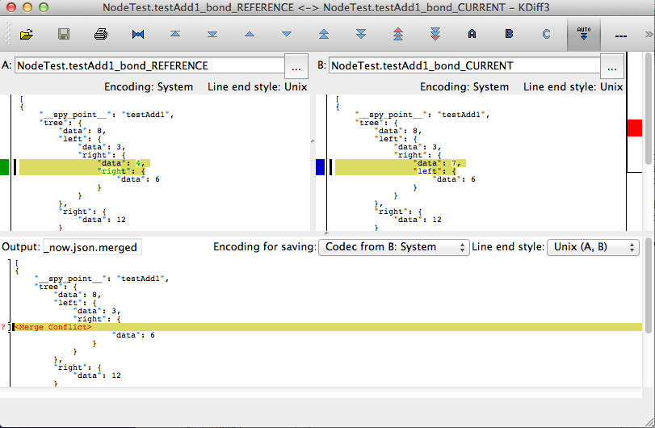

==========================
Bond Tutorial
==========================

Bond was designed to simplify the **development and maintenance** of automated tests. There are two main uses
of Bond: spying and mocking. These use cases are all supported by a total of four Bond functions. We'll discuss spying first.

Part 1: Spying with Bond
----------------------------------

Spying inside your test code
^^^^^^^^^^^^^^^^^^^^^^^^^^^^^^^^^^^

Spying with Bond is meant to replace writting the common equality assertion calls in your tests, i.e., the validation
that some state variable has some expected value. These assertions are tedious to write, and even more tedious to
update when your code or your test fixture change and you need to update the test. For this reason, people
tend to write fewer assertions than they should.

Consider, for example,
that you have just implemented binary-search-trees (BST) and want to write tests. You may write the following
testing code:

.. container:: tab-section-group

   .. container:: tab-section-python
               
        .. code-block:: python
            :emphasize-lines: 11-15
    
            def test_bst(self):
                tree = BST()
                tree.insert(8)
                tree.insert(12)
                tree.insert(3)
                tree.insert(4)
                tree.insert(6)
    
                # WITHOUT BOND: Add self.assertEquals here to verify the position in the tree
                # of all the data points, in the order in which they were inserted
                self.assertEquals(8, tree.data)
                self.assertEquals(12, tree.right.data)
                self.assertEquals(3, tree.left.data)
                self.assertEquals(4, tree.left.right.data)
                self.assertEquals(6, tree.left.right.right.data)
    
   .. container:: tab-section-ruby
               
        .. code-block:: ruby
            :emphasize-lines: 14-18
    
            # Using RSpec
            describe BST do
     
                it 'should insert correctly' do
                    tree = BST()
                    tree.insert(8)
                    tree.insert(12)
                    tree.insert(3)
                    tree.insert(4)
                    tree.insert(6)
    
                    # WITHOUT BOND: Add self.assertEquals here to verify the position in the tree
                    # of all the data points, in the order in which they were inserted
                    expect(tree.data).to eq(8)            
                    expect(tree.right.data).to eq(12)            
                    expect(tree.left.data).to eq(3)            
                    expect(tree.left.right.data).to eq(4)            
                    expect(tree.left.right.right.data).to eq(6)            
                end
            end

That is a lot of ``assertEquals``, and in fact, it is not even a complete test, because you'd have to
test, e.g., that 6 is a leaf node.

The alternative with Bond is as follows:

.. container:: tab-section-group

   .. container:: tab-section-python

      .. code-block:: python
            :emphasize-lines: 2, 13
    
            def test_bst(self):
                bond.start_test(self)              # Initialize Bond for this test
    
                tree = BST()
                tree.insert(8)
                tree.insert(12)
                tree.insert(3)
                tree.insert(4)
                tree.insert(6)
    
                # WITH BOND: record the value of the tree variable, and compare it
                # with previous recordings.
                bond.spy(tree=tree)  # Spy the whole tree

   .. container:: tab-section-ruby
                
        .. code-block:: ruby
            :emphasize-lines: 7, 19
    
            # Necessary to get the bond context
            require 'bond/spec_helper'
    
            # Using RSpec
            describe BST do
                # Automatically initializes Bond
                include_context :bond
     
                it 'should insert correctly' do
                    tree = BST()
                    tree.insert(8)
                    tree.insert(12)
                    tree.insert(3)
                    tree.insert(4)
                    tree.insert(6)
    
                    # WITH BOND: record the value of the tree variable, and compare it
                    # with previous recordings.
                    bond.spy(tree: tree)  # Spy the whole tree
                end
            end
         

What is happening there is that we call the ``bond.spy`` function to tell Bond to record the value of the
``tree`` variable. There could be multiple calls to ``bond.spy`` during a test.
The spied values (observations) are recorded in a file saved by default in a subdirectory called ``test_observations``.
This file should be checked in your repository along with your sources. Next time Bond runs the same test it will
compare the current observation with the reference one. If there are differences, before concluding that the
test has failed, you will get the opportunity
to interact with Bond to select what you want to be the new reference.

Here is the test observation spied by the test case we wrote above:

.. code-block:: javascript

    [
    {
        "tree": {
            "data": 8,
            "left": {
                "data": 3,
                "right": {
                    "data": 4,
                    "right": {
                        "data": 6
                    }
                }
            },
            "right": {
                "data": 12
            }
        }
    }
    ]

Note that this observation acts implicitly as 15 equality assertions (5 for the data values, and 10 more for
the ``left`` and ``right`` pointers on the nodes).
Furthermore, the assertions are presented in a structure that is much easier
to read that a sequence of equality assertions. Finally, with Bond your test code contains only the names
of the variables you want to assert on; the values they are equal to are saved separated from your test.
This will turn out to be crucial next.

If you need to make a change in the code, or in the testing setup, it is very tedious to fix the assertions.
Let's say that you decide that you get a better test coverage with a different tree where instead of 4 you want to
insert 7 in the tree. If you run the traditional test, you will see the familiar test failure:

.. container:: tab-section-group

    .. container:: tab-section-python

        .. code-block:: diff

            ======================================================================
            FAIL: testAdd1 (bst_tests.NodeTest)
            ----------------------------------------------------------------------
            Traceback (most recent call last):
              File "bond/pybond/tutorials/binary_search_tree/bst_tests.py", line 49, in test_bst
                self.assertEquals(4, tree.left.right.data)
            AssertionError: 4 != 7

    .. container:: tab-section-ruby

        .. code-block:: diff

            Failures:

              1) Node should add nodes to the BST correctly, testing without Bond
                 Failure/Error: expect(tree.left.right.data).to eq(4)
       
                   expected: 4
                        got: 7
       
                   (compared using ==)
                 # ./bst_spec.rb:20:in `block (2 levels) in <top (required)>'

Not only does your test abort on the first assertion, but it turns out that you have to fix
several of the assertions because the tree structure has changed. This is a common scenario when
your tests are aggressive about validating the data, and your test scenario or the underlying code
inevitably evolves.

With Bond, there is absolutely no change to the test code, precisely because the actual expected
tree shape is not part of your code! Instead, the test notices a discrepancy in the
observations, and tries to reconcile the observations.

You can read more about ``bond.start_test`` and ``bond.spy`` in the :ref:`API documentation <api_spy>`.

Reconciling Bond observations
^^^^^^^^^^^^^^^^^^^^^^^^^^^^^^^^^^^^^

Following along the previous example, when a test run finishes it compares the set of
spied observations with the saved reference ones. If there are no differences,
testing proceeds as before. If there are differences, there are multiple possible
reconciliation methods. By default, you will be presented with the a console
``diff`` of the changes and a small reconciliation menu, as shown below:

.. code-block:: diff

    --- bond/pybond/tutorials/binary_search_tree/test_observations/NodeTest/test_bst.json
    +++ bond/pybond/tutorials/binary_search_tree/test_observations/NodeTest/test_bst_now.json
    @@ -6,8 +6,8 @@
             "left": {
                 "data": 3,
                 "right": {
    -                "data": 4,
    -                "right": {
    +                "data": 7,
    +                "left": {
                         "data": 6
                     }
                 }

    There were differences in observations for NodeTest.test_bst:
    Do you want to accept the changes (NodeTest.test_bst) ? ( [y]es | [k]diff3 | *):

At this  point you can click "y" to accept the new changes (they will be saved as the new reference
and the test will pass), or "n" to abort the test. Furthermore, if you click "k" at the above prompt,
Bond will invoke a visual merging tool (in this case ``kdiff3``),
that allows you to navigate all differences, see the context in which they appeared by
inspecting nearby observations, select easily for each difference, or for all, whether the
new observed behavior is correct. If all differences are accepted, Bond will save the new observation file as
future reference. Voila! You have just updated the expected values with a click of a button. Bond gives you
deep assertions about your test while keeping the assertion maintenance cost low.

You can control the reconciliation method using a parameter to ``bond.start_test`` or with the environment
variable ``BOND_RECONCILE``, with possible values

* ``accept`` : accept the new observations and change the reference
* ``abort`` : abort the test
* ``console`` : show the above console interaction menu
* ``kdiff3``: invoke the ``kdiff3`` merging tool.

If the test fails, then you will still be shown the differences in the observations, but you will not have
the choice to accept them as the new reference observations.

The following is the UML sequence diagram for the interaction between the
test, the system-under-test (e.g., the binary-search tree example code from above),
and the Bond library:

.. uml::

   @startuml

   participant Test
   participant SUT as "System-under-test"
   participant Bond
   actor Diff as "Interactive merging tool"

   activate Test
   [-> Test 
   group "prepare test"
       activate Bond
       Test -> Bond : start_test*()
       Bond -> Test
   end
   Test -> SUT : insert()
   SUT -> Bond : spy('intermediate data')
   SUT -> Test
   Test -> Bond : spy('data')
   Test -> Bond : spy('more data')

   group "finish test"
       Test -> Bond: end_test*()
       Bond -> Bond : save\nobservations
    
       alt observations different from reference
          Bond -> Diff: interactive reconcile
          Diff -> Bond
       end
        
       Bond -> Test
   end
   deactivate Bond
   deactivate Test
   @enduml

Once ``start_test()`` has been called, any subsequent call to
``bond.spy`` will record the observations, which are saved at the end
of the test. Both the test and the system-under-test can spy values.
If the saved observations are different from the
reference ones, an interactive merging session is initiated to decide
whether the current observations should be the new reference ones. 

Note that the ``start_test()`` method is explicit in Python, but is
implicit in Ruby, if you add ``include_context :bond`` to the RSpec
test. The ``end_test()`` method call is automatic at the end of the
test both in Python and in Ruby. 

Spying inside your production code while testing
^^^^^^^^^^^^^^^^^^^^^^^^^^^^^^^^^^^^^^^^^^^^^^^^^^^^

Sometimes you want to validate the behavior of your code during testing, beyond just
checking the state at the end of the test. For this purpose you
can use ``bond.spy`` in your production code. This function has effect only if you
called ``bond.start_test`` first.

In the next section we will see another Bond function for spying, and mocking, inside
your production code.

For a pattern to use when including Bond in production code, see :ref:`pattern_bond_import`.

Part 2: Mocking with Bond
--------------------------------

Sometimes you want not only to spy values from your production code,
but also to replace some of those values. Spying and mocking together
can be achieved if you place the ``bond.spy_point`` annotation on a
function or a method in your production code.  Let's assume that the
code to be tested (system under test) is expected to invoke a
collaborator method called ``make_request``, whose
purpose is to make HTTP requests to other services. You may want to
spy how many times this method is called in your tests, and with what
arguments, and possibly what it returns for each call. You also want
your tests to be able to bypass the actual HTTP request and provide
mock results for this function.  This can be achieved with the
``bond.spy_point`` function annotation, as shown below: (note that for
Ruby, any class or module which you wish to spy on must ``extend
BondTargetable``)

.. container:: tab-section-group

   .. container:: tab-section-python

      .. code-block:: python
            :emphasize-lines: 1
    
            @bond.spy_point()
            # Among other things, has the effect of injecting a call to
            #
            #     bond.spy(spy_point_name='module.make_request', url=url, data=data)
            #
            # where `module` is the name of the module containing make_request.
            # If make_request was contained within a class, the default spy point 
            # name would be `Class.make_request`.
            def make_request(url, data=None):
                "HTTP request (GET, or POST if the data is provided)"
                resp = urllib2.urlopen(url, data)
                return (resp.getcode(), resp.read())
    
    
   .. container:: tab-section-ruby

        .. code-block:: ruby
           :emphasize-lines: 3,5
    
            class MyClass
                # Denotes this class as being able to be targetted by Bond
                extend BondTargetable
    
                bond.spy_point
                # Among other things, has the effect of injecting a call to
                #
                #     bond.spy('MyClass#make_request', url: url, data: data)
                #
                # If make_request was a class method, `MyClass.make_request`
                # would have been used instead. 
                def make_request(url, data=nil)
                    uri = URI(url)
                    if data.nil?
                        resp = Net::HTTP.get_response(uri)
                    else
                        resp = Net::HTTP.post_form(uri, data)
                    end
                    return [resp.code, resp.message]           
                end
            end
        

Just like ``bond.spy``, this annotation has effect only if ``bond.start_test`` has been called, meaning that
this is a test run. One of the effects of this annotation is to inject a call to ``bond.spy`` with
the method name as the spy point and the arguments as the observation, as shown in the code
example above.

You can read more about ``bond.spy_point`` in the :ref:`API documentation <api_spy_point>`.
Read on to find out what else you can do with spy point annotations.

A spy point annotation on a method is also able to inject code to execute on every call to the
method. This code can do multiple things, and can be controlled from the test code:

* further decide on which invocations of the spy point they activate, based on various filters on the function arguments.
* spy the values of the arguments, and optionally the result also.
* control which arguments are spied and how the observations are formatted.
* execute additional test code on each call.
* bypass the actual body of the method and return a result prepared by the testing code, or throw an exception when the call is reached.

The behavior of spy points can be controlled with agents that are deployed from the
test code, as shown in the following example, where the test is deploying two
agents for the ``make_request`` spy point that we have instrumented earlier.

.. container:: tab-section-group

   .. container:: tab-section-python

      .. code-block:: python
           :emphasize-lines: 2-8
   
           def test_with_mocking(self):
               bond.start_test()
               bond.deploy_agent('module.make_request',
                                 url__endswith='/books',
                                 result=(200, json.dumps(mock_books_response)))
               bond.deploy_agent('module.make_request',
                                 url__contains='/books/100',
                                 result=(404, 'Book not found'))
   
               call_my_code_that_will_make_request()
   
   
   .. container:: tab-section-ruby

       .. code-block:: ruby
           :emphasize-lines: 2-7
   
           it 'should be able to call out to mock services' do
                bond.deploy_agent('MyClass#make_request', 
                                  url__endswith: '/books',
                                  result: [200, mock_books_response.to_json])
                bond.deploy_agent('MyClass#make_request',
                                  url__contains: '/books/100',
                                  result: [404, 'Book not found'])
   
                call_my_code_that_will_make_request()
           end

In the above example the first agent will instruct the ``make_request`` spy point to
skip the actual body of the method and return immediately a respose with status code
200 and the body being some mocked data structure. The value provided as ``result``
by the agent is used directly in place of the normal return of the method. The second
agent simulates a 404 error when a particular url is encountered.

The later deployed spy agents override previously deployed ones. This is useful when you want to
deploy a default agent, e.g., return success on every HTTP request, and then for specific tests,
or during a test, you want to deploy a more specific agent that has another behavior.

You can read more about ``bond.deploy_agent`` in the :ref:`API documentation <api_deploy_agent>`.

The following is the UML sequence diagram for using Bond for mocking:

.. uml::

   @startuml

   participant Test
   participant SUT as "System-under-test"
   participant DOC as "Collaborator\nlibrary"
   participant Bond
   actor Diff as "Interactive merging tool"

   activate Test
   [-> Test 
   activate Bond
   group "prepare test"
       Test -> Bond : start_test*()
       Bond -> Test
       Test -> Bond : deploy_agent(...)
       Test -> Bond : deploy_agent(...)
   end

   Test -> SUT : call_my_code()
   SUT -> DOC : make_request(url)
   DOC -> Bond : spy('make_request', url=url)
   Bond -> Bond : find and use\nactive agent
   Bond -> SUT : mock response
   SUT -> Test

   group "finish test"
      Test -> Bond: end_test*()
      Bond -> Bond : save\nobservations
   
      alt observations different from reference
         Bond -> Diff: interactive reconcile
         Diff -> Bond
      end
       
      Bond -> Test
   end
   deactivate Bond
   @enduml

In the above diagrams we see that the test would deploy a number of
agents for specific spy points that would be reached during the
execution, before the test invokes the system under test. When the
system under test invokes the collaborator method on which a spy point
has been declared, Bond is going to look for an active deployed agent
for that spy point and use the mock result provided by the agent. 

That's it! Bond is simple but the possibilities are endless. You can be a pro now!

More Usage Examples
---------------------------

To learn more about usage patterns visit :ref:`patterns`.

To see a more elaborate example of using Bond visit :ref:`examples`.
